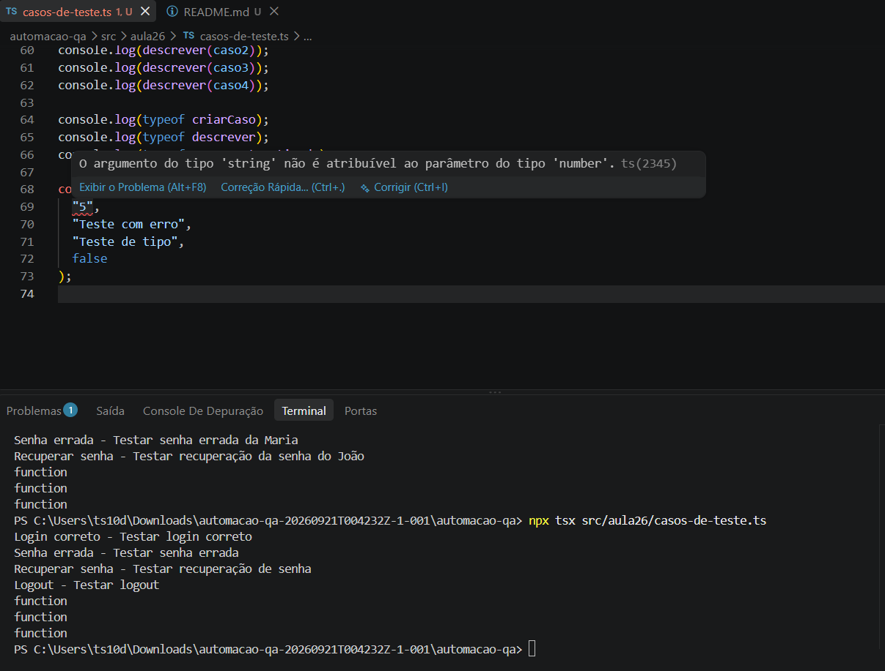

Casos de Teste
O que foi feito

Foi criado um arquivo em TypeScript para representar casos de teste de QA.

Foi criado o tipo CasoDeTeste com as seguintes informações:

id

nome

descrição

automatizado

Também foram criadas as funções:

criarCaso

descrever

marcarAutomatizado

Foram criados alguns casos de teste e também foi usado typeof para verificar o tipo das funções.

Como rodar

Para executar o arquivo, use:

npx tsx src/aula26/casos-de-teste.ts

O programa mostra os casos de teste e o tipo das funções no terminal.

Erro de tipo

Foi provocado um erro de propósito passando um texto onde a função criarCaso esperava um número.

Exemplo:

const casoErro = criarCaso(
  "5",
  "Teste com erro",
  "Teste de tipo",
  false
);

Nesse caso, o TypeScript informa que string não pode ser usado onde é esperado um number.

Foi tirado um print do erro mostrado pelo editor como parte da atividade.

## Print do erro

